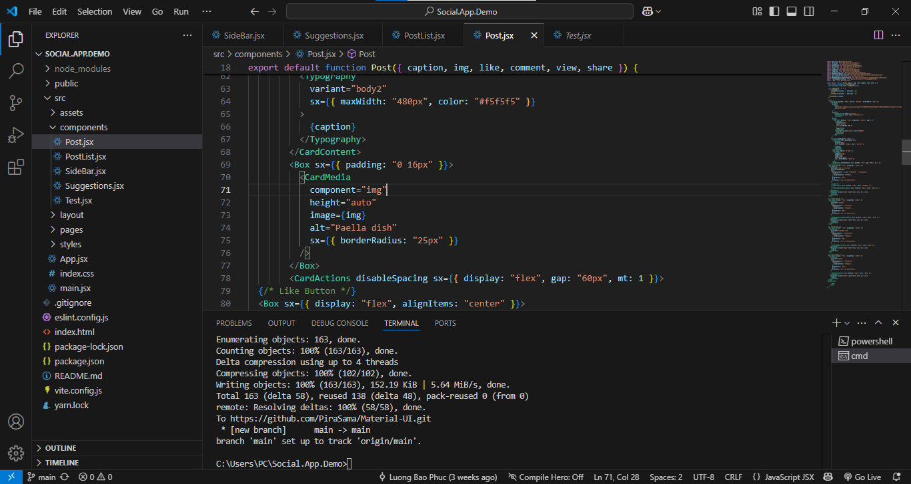
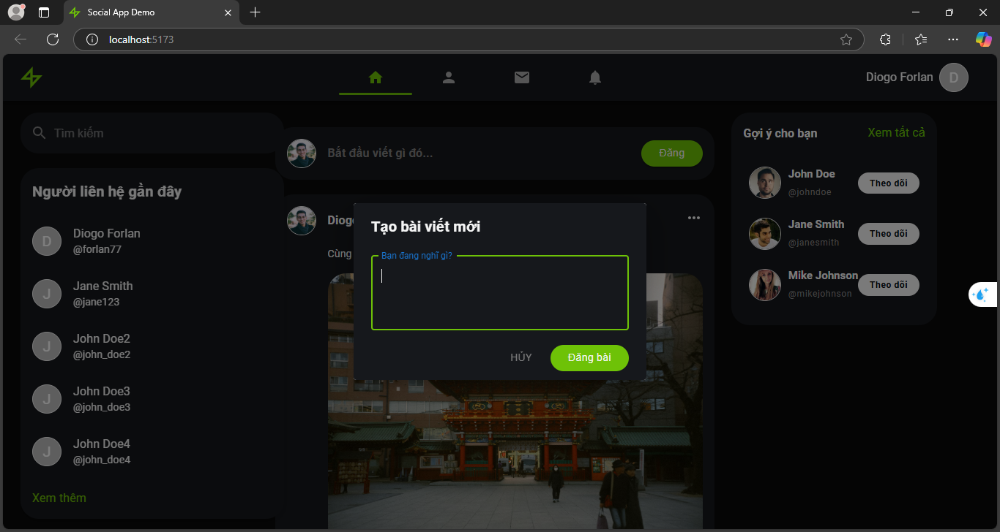
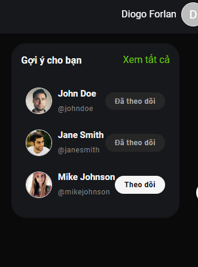

# Cách dùng

```
# Tải dự án về
git clone https://github.com/nhattVim/Social.App.Demo.git
cd Social.App.Demo

# Nếu dùng yarn
yarn
yarn dev

# Nếu dùng npm
npm i
npm run dev
```

#Screenshot của màn hình IDE project



#Giao diện ban đầu


#Giao diện sau khi tùy chỉnh 





#Giao diện chức năng tìm kiếm


