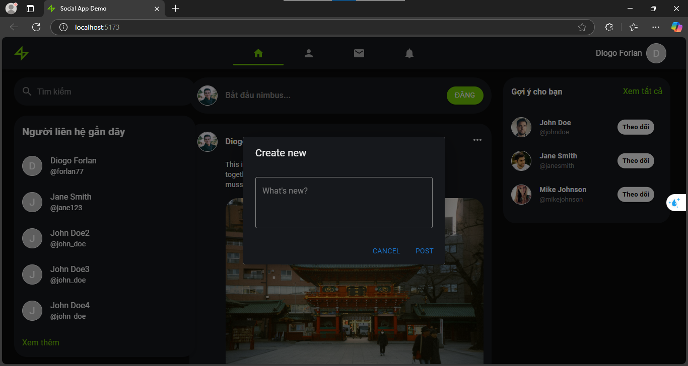

# Cách dùng

```
# Tải dự án về
git clone https://github.com/nhattVim/Social.App.Demo.git
cd Social.App.Demo

# Nếu dùng yarn
yarn
yarn dev

# Nếu dùng npm
npm i
npm run dev
```
#Giao diện ban đầu



